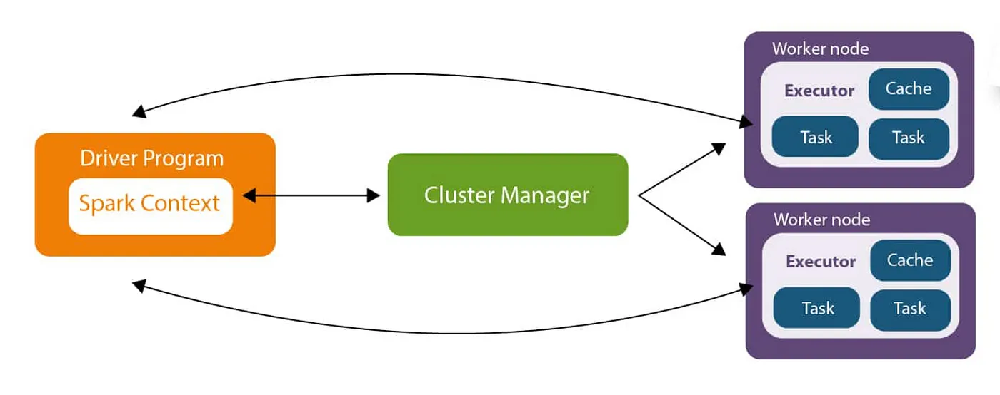
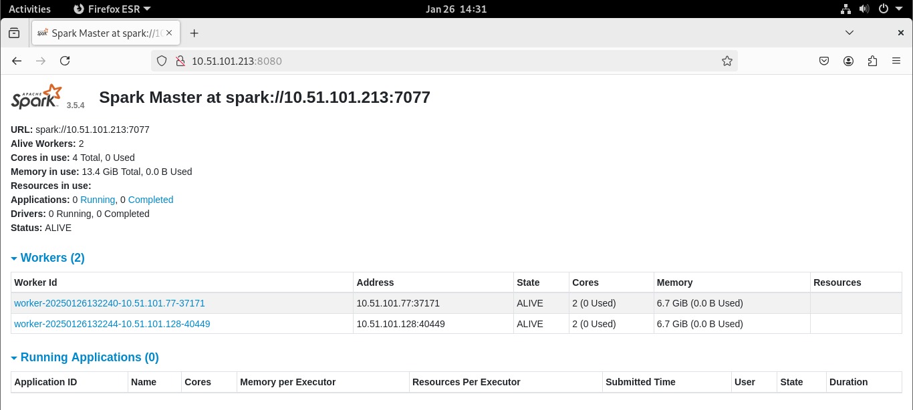

# Spark Cluster on LXC Containers

## Architecture Overview


The cluster consists of:
- Driver Program with Spark Context
- Cluster Manager
- Worker Nodes with Executors, Tasks, and Cache

## Prerequisites
- LXC/LXD installed and initialized
- Terraform installed
- Ansible installed
- sshpass installed

## Project Structure
```
spark-cluster/
├── terraform/
│   ├── test.tf              # Infrastructure definition
│   ├── variables.tf         # Variable declarations
│   ├── terraform.tfvars     # Variable values
│   └── templates/
│       └── inventory.tpl    # Ansible inventory template
└── ansible/
    ├── site.yml            # Main playbook
    └── templates/
        ├── spark-master.service.j2
        └── spark-worker.service.j2
```

## Deployment Workflow

### 1. Initial Setup
```bash
# Clone repository and enter directory
git clone [repository-url] spark-cluster
cd spark-cluster

# Set LXC storage
lxc storage set default size=15GB
```

### 2. Infrastructure Deployment (Terraform)
```bash
# Enter terraform directory
cd terraform

# Initialize Terraform
terraform init

# Review changes
terraform plan

# Apply infrastructure
terraform apply

# Note: This will generate ansible/inventory.yml automatically
```

### 3. Configuration Management (Ansible)
```bash
# Enter ansible directory
cd ../ansible

# Verify inventory.yml exists and contains correct IPs
cat inventory.yml

# Run playbook
ansible-playbook -i inventory.yml site.yml
```

## Verification

### 1. Spark Web UI
Access Spark UI at `http://<master-ip>:8080`. You should see:


Expected results:
- Status: ALIVE
- URL: spark://<master-ip>:7077
- Workers: 2
- Cores in use: 4 Total (2 per worker)
- Memory in use: 13.4 GiB Total (6.7 GiB per worker)
- Applications: Ready for submissions

### 2. Test Spark Shell
```bash
ssh debian@<master-ip>
/opt/spark/bin/spark-shell --master spark://spark-master:7077

# Example test
scala> val data = 1 to 1000
scala> val distData = sc.parallelize(data)
scala> distData.reduce(_ + _)
```

## Troubleshooting Guide

### Common Issues
1. Terraform Issues:
- `Error: Error acquiring lock`: Delete `.terraform.lock.hcl`
- Provider errors: Run `terraform init -upgrade`

2. Ansible Issues:
- `UNREACHABLE`: Check SSH and network connectivity
- `Permission denied`: Verify sudo rights and passwords

3. Spark Issues:
- Workers not connecting: Check service status and logs
- Connection refused: Verify IP configurations

### Logs Location
- Terraform: `terraform.tfstate`
- Ansible: Default system log
- Spark: `/opt/spark/logs/`

## Adding Workers
To scale the cluster:
1. Update `terraform.tfvars` worker count
2. Run:
```bash
cd terraform
terraform apply
cd ../ansible
ansible-playbook -i inventory.yml site.yml
```